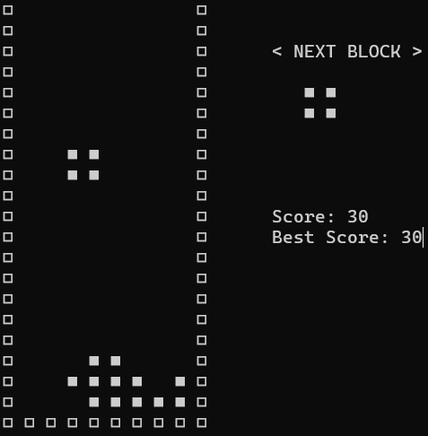

# Text Tetris

A simple, text-based implementation of the classic Tetris game written in C. This project runs on both Unix-like systems (Linux, macOS) and Windows.

<p align="center">
  
</p>

## Features

*   **Classic Gameplay**: Full Tetris mechanics including rotating blocks, line clearing, and scoring.
*   **Cross-Platform**: Compatible with both Windows and Linux/macOS environments.
*   **Score Saving**: Automatically saves game results (Name, Score, Date, Rank) to a local file.
*   **Ranking System**: Tracks and displays top scores.
*   **Search**: Ability to search for past game records by player name.

## Controls

| Key | Action |
| :---: | :--- |
| **`j`** | Move Left |
| **`l`** | Move Right |
| **`k`** | Soft Drop (Move Down) |
| **`i`** | Rotate Block |
| **`a`** | Hard Drop (Instant Drop) |
| **`p`** | Return to Menu |

## How to Build and Run

### Prerequisites

*   GCC Compiler
*   Make

### Building the Game

Open your terminal or command prompt in the project directory and run:

```bash
make
```

This will compile the source code and generate the executable (`tetris` or `tetris.exe`).

### Running the Game

You can run the game using the make command:

```bash
make run
```

Or execute it directly:

**Linux/macOS:**
```bash
./tetris
```

**Windows:**
```cmd
tetris.exe
```

### Cleaning Up

To remove compiled files and the results record:

```bash
make clean
```

## File Structure

*   `tetris.c`: The main source code containing game logic, UI rendering, and file I/O.
*   `makefile`: Build script for compiling and running the project on different platforms.
*   `results.txt`: Stores the game history and rankings (generated after the first game save).
